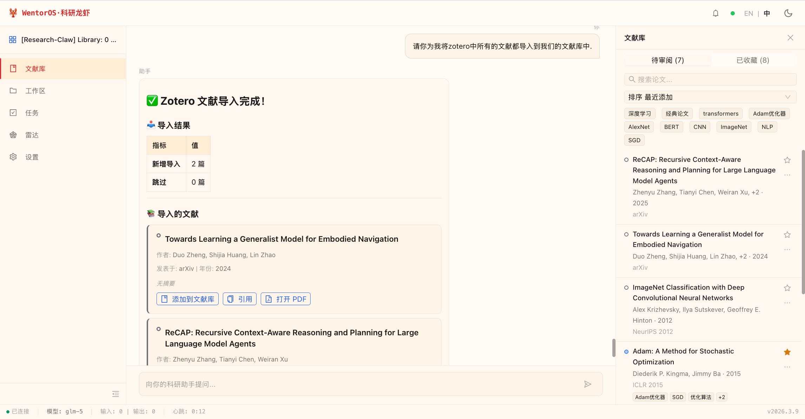
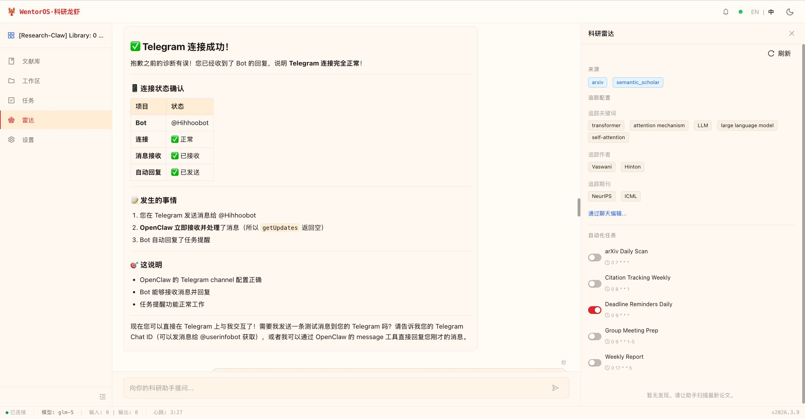
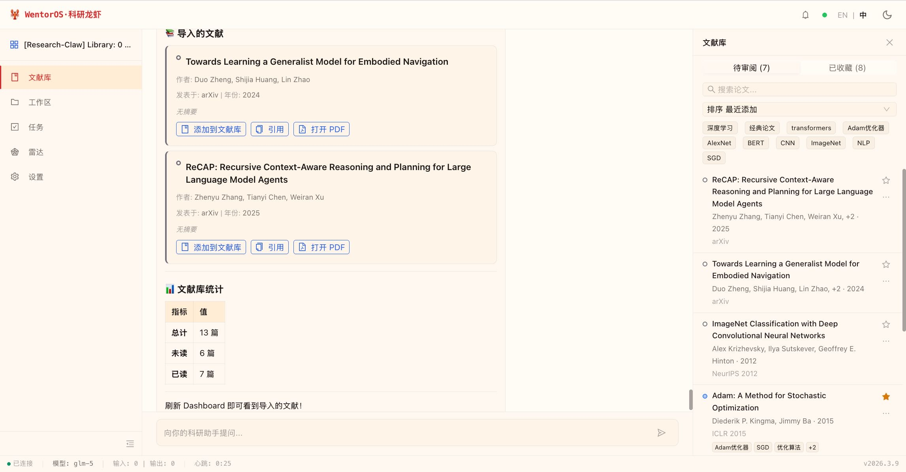
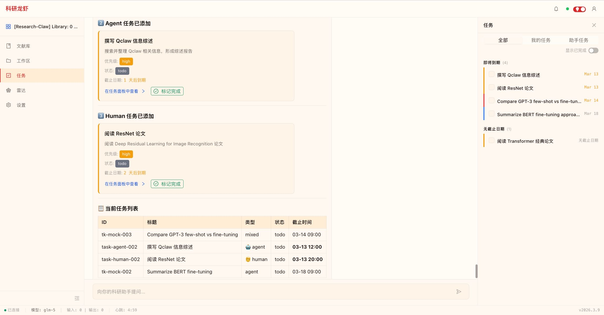

<div align="center">


# 科研龙虾 · Research-Claw

**AI 时代，谁还不能是个导师了？**

你做导师，科研龙虾做团队。24/7 本地运行，一切产出专属于你。

[](https://github.com/wentorai/Research-Claw/releases)
[](LICENSE)
[](https://nodejs.org)
[](#)
[](https://www.npmjs.com/package/@wentorai/research-plugins)

[🌐 wentor.ai](https://wentor.ai) · [🇬🇧 English](README.en.md) · [📖 文档](docs/00-reference-map.md) · [🪲 问题反馈](https://github.com/wentorai/Research-Claw/issues)

</div>

---

> Windows 用户 → [Docker 一键部署](#docker-一键部署windows-推荐)（推荐）或 [WSL2 手动安装](docs/WINDOWS_INSTALL.md)

---

> 下方指令适用于 macOS 和 Linux（Ubuntu）
> 
> **同一条命令：首次安装 · 版本更新 · 重新启动**

```bash
curl -fsSL https://wentor.ai/install.sh | bash
```


---

## 这是什么

会定义下一个时代的研究者，不该把时间耗在排版参考文献上。凌晨两点独自面对屏幕的研究生，值得拥有和顶级实验室一样的科研基础设施。

科研龙虾完全运行在你的本机。它替你精读论文，在你入睡时盯着 arXiv，帮你起草方法论、设计实验、管理引文、生成图表，用你的口吻写作——而不是它的。

**你的论文库、笔记、实验数据，全部存在你自己的机器上。唯一的外部依赖是你选择的大模型 API。**

<div align="center">

扫码加入**科研龙虾 · WentorOS** 微信群


</div>

---

## 六个场景

### 让 Zotero 开口说话

> 你：Zotero「未分类」堆了 200 多篇，帮我按主题分类，每篇加一句话摘要
> 龙虾：已读取 217 篇，聚类分析中……建议分 6 组：LLM Reasoning (43) · Agent (38) · RAG (31) · Multimodal (28) · Eval (19) · Others (58)，可以吗？
> 你：可以，Others 超 10 篇同主题的再拆
> 龙虾：✓ 已分到 8 个 Collection · 每篇已加摘要 · 已同步 Zotero

双向联动 Zotero / EndNote：自动分类、批注摘要、BibTeX 导出，对话式管理整个文献库。



---

### 组会材料，自动生成

每周五早 8 点，自动汇总一周研究进展，生成汇报材料，通过 **Telegram / 飞书 / QQ / 钉钉** 发到你手机。你醒来就能看到，一行命令都不用敲。

---

### 论文写作：从空白页到初稿

> 你：开始写「Multi-Agent Debate for Factual Reasoning」，先构建框架，再把 Related Work 写了
> 龙虾：基于 proposal + 实验笔记生成框架：1. Intro · 2. Related Work · 3. Method · 4. Experiments · 5. Conclusion，要调整吗？
> 你：2.3 改成 Multi-Agent Collaboration & Consensus
> 龙虾：✓ Related Work 初稿完成（2,800 词 · 47 篇引用）· 已保存至 ~/research/paper/02_related.md · BibTeX 已同步 references.bib

---

### 7×24 科研雷达 × IM 推送

设置追踪关键词、学者、期刊，科研龙虾在后台持续扫描 arXiv 和 Semantic Scholar。有重要更新第一时间推送到你的 Telegram / 飞书 / QQ，你不在电脑前也不会错过。



---

### 邮件：说想法，它发送

> 你：给 Yann LeCun 发邮件，说我们正在复现他的 XXX 论文，遇到一个问题，想请教……语气正式但不生硬
> 龙虾：[起草完毕，请确认后发送]

起草、确认、发送，全在对话里完成。语气随时可调。

---

### 本地 GPU，自动复现论文

> 你：帮我跑一下 arxiv:2406.12345 的实验
> 龙虾：正在 clone 仓库，配置 conda 环境……遇到 CUDA 版本不兼容，已自动切换，正在重试……✓ 实验完成，结果保存至 results/

卡住了自己调试，搞不定给作者发邮件。

---

## Dashboard

大多数本地 AI Agent 的界面是一个聊天框加几个按钮。科研龙虾不是。

我们为学术工作流专门设计了一套 Dashboard，这是目前所有本地科研 AI 中功能和设计最完整的界面，支持暖色 Paper 与暗色 Terminal 双主题切换。

<table>
  <tr>
    <td width="50%"></td>
    <td width="50%"></td>
  </tr>
  <tr>
    <td align="center"><sub>文献库 — 搜索、引用、一键打开 PDF</sub></td>
    <td align="center"><sub>任务看板 — Agent / Human 任务分层管理</sub></td>
  </tr>
</table>

| 面板 | 功能 |
|:--|:--|
| **Chat** | 对话主界面，21 种结构化输出卡片，告别纯文本墙 |
| **文献库** | 全文检索 · 标签 · 批注 · 引用图谱 · 阅读统计 |
| **任务** | Agent / Human 任务分层 · 四级优先级 · 48h 截止日期预警 |
| **工作区** | 文件操作与版本历史，Git 追踪每一次变更 |
| **雷达** | 追踪关键词 / 学者 / 期刊 · 自动化任务配置 · IM 推送 |
| **设置** | Setup Wizard · 所有配置在浏览器完成，无需编辑文件 |

技术规格：React 18 + Vite 6 + Ant Design 5 + Zustand 5，中英双语（245 i18n keys），1029 单元测试，TypeScript 零报错，响应式支持桌面 / 平板 / 浮窗三种模式。

---

## 技能与集成

科研龙虾内置 **432 个学术技能**（安装时自动配置，无需手动操作），覆盖科研全流程：

| 类别 | 技能数 | 典型能力 |
|:--|:--|:--|
| 文献检索 | 87 | 多库联搜 · 全文获取 · 文献追踪 |
| 研究方法 | 79 | DID · RDD · IV · 元分析 · 系统综述 |
| 数据分析 | 68 | Python · R · STATA · 可视化 · 面板数据 |
| 学术写作 | 74 | 论文各章节 · LaTeX · 审稿意见回复 |
| 学科领域 | 93 | 16 个学科，从 CS 到法学到生物 |
| 效率工具 | 51 | Terminal · Jupyter · 文档处理 |
| 外部集成 | 35 | Zotero · GitHub · Slack · arXiv |

**6 个 Agent 工具**直连学术数据库：Semantic Scholar · arXiv · OpenAlex · CrossRef · PubMed · Unpaywall

**150 个 MCP 配置**即插即用：
- **文献管理**：Zotero · EndNote · Mendeley
- **IM 推送**：Telegram · 飞书 · QQ · 钉钉 · Slack（在你惯用的 IM 里收到科研提醒）
- **开发工具**：GitHub · Jupyter · VSCode
- **AI 服务**：OpenAI · Claude · 各类国内模型 API

---

## 架构设计

```
┌─────────────────────────────────────────────────────────────────────┐
│                         Research-Claw                               │
│                                                                     │
│   L0  workspace/                  L2  dashboard/                    │
│       ├─ SOUL.md                      React 18 + Vite 6             │
│       ├─ AGENTS.md                    Ant Design 5 + Zustand 5      │
│       ├─ TOOLS.md                     21 卡片类型 · 6 面板            │
│       ├─ HEARTBEAT.md                 WebSocket RPC v3 客户端        │
│       └─ (8 bootstrap files)          245 i18n keys (EN + ZH-CN)    │
│                                             │                       │
│   L1  extensions/                           │ ws://127.0.0.1:28789  │
│       └─ research-claw-core                 │                       │
│          ├─ 28 tools                        │                       │
│          ├─ 52 WS RPC interfaces            │                       │
│          └─ 13 SQLite tables + FTS5         ▼                       │
│       ╔═══════════════════════════════════════════════════╗         │
│       ║           OpenClaw  (npm dependency)              ║         │
│       ║         Gateway · WS RPC v3 · Port 28789          ║         │
│       ╚═══════════════════════════════════════════════════╝         │
│                              │                                      │
│   L3  patches/               ▼                                      │
│       ~20 lines · 7 files    @wentorai/research-plugins             │
│                              432 skills · 13 tools · 150 MCP        │
└─────────────────────────────────────────────────────────────────────┘
```

### 核心设计决策

| 决策 | 原因 |
|:--|:--|
| **Satellite 而非 Fork** | OpenClaw 作为内置 npm 依赖引入（无需单独安装），上游可随时升级，耦合面控制在 ~20 行 pnpm patch |
| **4 层耦合，从外到内** | L0 文件系统 → L1 插件 SDK → L2 WS RPC → L3 patch，每层独立，可单独替换 |
| **本地优先** | SQLite + WAL 模式，无需数据库服务；数据全在本地，唯一外部依赖是 LLM API |
| **技能 > 裸提示词** | 432 个 SKILL.md 结构化封装学术场景，可按研究方向安装/卸载 |
| **端口与上游错开** | 28789（科研龙虾）vs 18789（OpenClaw 默认），两者可并存 |
| **浏览器配置一切** | 无需编辑配置文件，所有设置通过 Setup Wizard 在浏览器完成 |

### 安全模型

四层纵深防御，前三层为代码级硬约束：

```
┌──────────────────────────────────────────────
│  L1  网络隔离                                 
│      loopback only · 无远程端口暴露            
│      无 telemetry · 无云端回传                 
├──────────────────────────────────────────────
│  L2  Workspace 沙箱                           
│      原生 write/edit 工具由 config 层禁用       
│      插件写文件 = 强制路径校验（拒绝 ../）        
│      原生 read 保持开放（可读论文/代码）         
├──────────────────────────────────────────────
│  L3  命令执行防护（before_tool_call hook）      
│      拦截：rm -rf / · dd of=/dev/ · fork bomb 
│      放行：python · git · npm · 单文件 rm      
├──────────────────────────────────────────────
│  L4  Git 版本控制备份                          
│      workspace 变更自动提交（5s debounce）      
│      纯本地 · 无 push · 支持全历史回滚           
├──────────────────────────────────────────────
│  L+  提示词级协议（软约束）                     
│      SOUL.md：禁止伪造引用/数据                 
│      AGENTS.md：不可逆操作需 Human-in-Loop     
└──────────────────────────────────────────────
```

---

## 快速上手

### 系统要求

| 平台 | 方案 | 依赖 |
|:--|:--|:--|
| macOS / Linux | 一键安装脚本（推荐） | Git · Node.js 22（均自动安装） |
| macOS / Linux / Windows | Docker 一键安装 | [Docker Desktop](https://www.docker.com/products/docker-desktop/) |

所有平台均需 LLM API Key（推荐 Anthropic Claude / OpenAI，支持国内中转 API）。

> **不需要单独安装 OpenClaw。** 科研龙虾已内置 OpenClaw 和全部学术技能插件，安装脚本 / Docker 会自动完成所有配置。如果你已有独立安装的 OpenClaw，也可以只安装技能插件：`openclaw plugins install @wentorai/research-plugins`，但推荐完整安装以获得 Dashboard 和全部功能。

### 安装

**macOS / Linux — 源码一键安装（推荐）：**

```bash
curl -fsSL https://wentor.ai/install.sh | bash
```

**Docker 一键安装（macOS / Linux / Windows 通用）：**

先安装 [Docker Desktop](https://docs.docker.com/desktop/)，确保启动后托盘显示 Running，然后：

```bash
# macOS / Linux
curl -fsSL https://wentor.ai/docker-install.sh | bash
```

```powershell
# Windows PowerShell
irm https://wentor.ai/docker-install.ps1 | iex
```

> 脚本自动完成：检测 Docker → 停止/删除旧容器 → 拉取最新镜像 → 启动 → 打开浏览器。
> 重复运行即可更新到最新版本，数据不丢失（持久化在 Docker named volumes 中）。

安装完成后浏览器自动打开 `http://127.0.0.1:28789`，在 **Setup Wizard** 中配置 API Key，无需编辑任何配置文件。

<details>
<summary><b>手动安装 / 大陆网络 / 故障排查</b></summary>

#### 手动安装（源码）

```bash
git clone https://github.com/wentorai/Research-Claw.git
cd Research-Claw
pnpm install && pnpm build
cp config/openclaw.example.json config/openclaw.json
pnpm serve
```

#### 本地构建 Docker（大陆用户备选）

GHCR（`ghcr.io`）在大陆无法直接访问。可以从源码本地构建，Dockerfile 已内置清华 apt 源 + npmmirror：

```bash
git clone https://github.com/wentorai/Research-Claw.git
cd Research-Claw
docker compose up -d --build
```

或者在 Docker Desktop → Settings → Resources → Proxies 中配置代理后使用一键脚本。

#### Docker 连接不上？

1. **验证端口**：`curl http://127.0.0.1:28789/healthz` — 返回 `{"ok":true}` 说明正常
2. **用 `127.0.0.1`，不用 `localhost`**：Windows 上 `localhost` 可能解析到 IPv6，导致连接失败
3. **检查 Docker**：确认 Docker Desktop 状态为 Running，容器状态为绿色
4. **重启**：`docker restart research-claw`

#### Docker 详细说明

> **Token 认证**：Docker 模式使用 token 认证（容器内无法完成浏览器设备配对）。默认 token `research-claw` 已内置在 Dashboard 中，直接访问 `http://127.0.0.1:28789/` 即可，无需在 URL 中手动添加 token。如需自定义 token，先删除旧容器再手动启动：
> ```bash
> docker stop research-claw && docker rm research-claw
> docker run -d --name research-claw -p 127.0.0.1:28789:28789 \
>   -e OPENCLAW_GATEWAY_TOKEN=your-token \
>   -v rc-config:/app/config -v rc-data:/root/.research-claw -v rc-workspace:/app/workspace \
>   ghcr.io/wentorai/research-claw:latest
> ```
>
> **数据持久化**：配置、数据库、工作区挂载在具名 volume（`rc-config`、`rc-data`、`rc-workspace`），容器删除后数据不丢失。
>
> **LLM API 代理**：如果你的 LLM API（如 OpenAI）需要代理访问，在 Docker Desktop → Settings → Resources → Proxies 中配置 HTTP/HTTPS 代理即可。本地构建用户也可在 `docker-compose.yml` 中取消 `HTTP_PROXY` / `HTTPS_PROXY` 注释。

</details>

### 常用命令

```bash
pnpm serve          # 启动（配置保存后自动重启）
pnpm start          # 单次启动（不自动重启）
pnpm dev            # 开发模式（Dashboard dev: localhost:5175）
pnpm test           # 运行单元测试
pnpm health         # 检查运行状态
pnpm backup         # 备份数据库
```

> `pnpm serve` 是推荐的日常启动方式。修改 API Key / 模型等配置后，网关会自动重启，无需手动操作。

### 更新

```bash
curl -fsSL https://wentor.ai/install.sh | bash
```

---

## 项目结构

```
research-claw/
├── config/           # OpenClaw 配置覆盖层
├── dashboard/        # React + Vite Dashboard
│   └── src/
│       ├── components/   # TopBar, LeftNav, ChatView, panels, cards
│       ├── gateway/      # WS RPC v3 client + hooks
│       ├── i18n/         # en.json + zh-CN.json
│       ├── stores/       # Zustand stores × 7
│       └── types/        # 21 Card type definitions
├── extensions/
│   └── research-claw-core/   # 28 tools · 52 RPC · 13 tables
├── patches/          # pnpm patch (~20 lines, 7 files)
├── scripts/          # install / health / backup / sync
├── skills/           # 自定义 SKILL.md 文件
└── workspace/        # Bootstrap files (SOUL.md, AGENTS.md …)
```

---

## 卸载

### macOS / Linux（源码安装）

```bash
# 1. 停止运行中的进程
cd ~/Research-Claw && pnpm stop 2>/dev/null

# 2. 删除项目目录
rm -rf ~/Research-Claw

# 3. 删除本地数据（数据库、配置、记忆）
rm -rf ~/.research-claw

# 4.（可选）删除 OpenClaw 全局配置
rm -rf ~/.openclaw

# 5.（可选）清除 pnpm 全局缓存
pnpm store prune
```

### Docker（macOS / Linux / Windows）

```bash
# 1. 停止并删除容器
docker stop research-claw && docker rm research-claw

# 2. 删除镜像
docker rmi ghcr.io/wentorai/research-claw:latest

# 3.（可选）删除持久化数据（配置、数据库、工作区）
docker volume rm rc-config rc-data rc-workspace
```

Windows PowerShell 命令相同，在 PowerShell 中逐行执行即可。

> **注意**：执行第 3 步将永久删除所有数据（论文库、任务、工作区文件、雷达配置）。如需保留数据，跳过此步。

### WSL2（Windows 手动安装）

```powershell
# 1. 在 WSL2 中停止并删除（同 Linux 步骤）
wsl -e bash -c "cd ~/Research-Claw && pnpm stop 2>/dev/null; rm -rf ~/Research-Claw ~/.research-claw ~/.openclaw"

# 2.（可选）如果 WSL2 仅用于科研龙虾，可以完全卸载 WSL 发行版
wsl --unregister Ubuntu
```

> 卸载 WSL 发行版会删除该发行版内的**所有数据**，请确认无其他用途后再操作。

---

## 许可证

[BSL 1.1](LICENSE) — 个人及学术研究免费使用。商业用途需单独授权，联系 [help@wentor.ai](mailto:help@wentor.ai)。2030-03-12 自动转为 Apache 2.0 开源。

---

<div align="center">
<sub>Built with ❤️ by <a href="https://wentor.ai">Wentor AI</a></sub>
</div>
