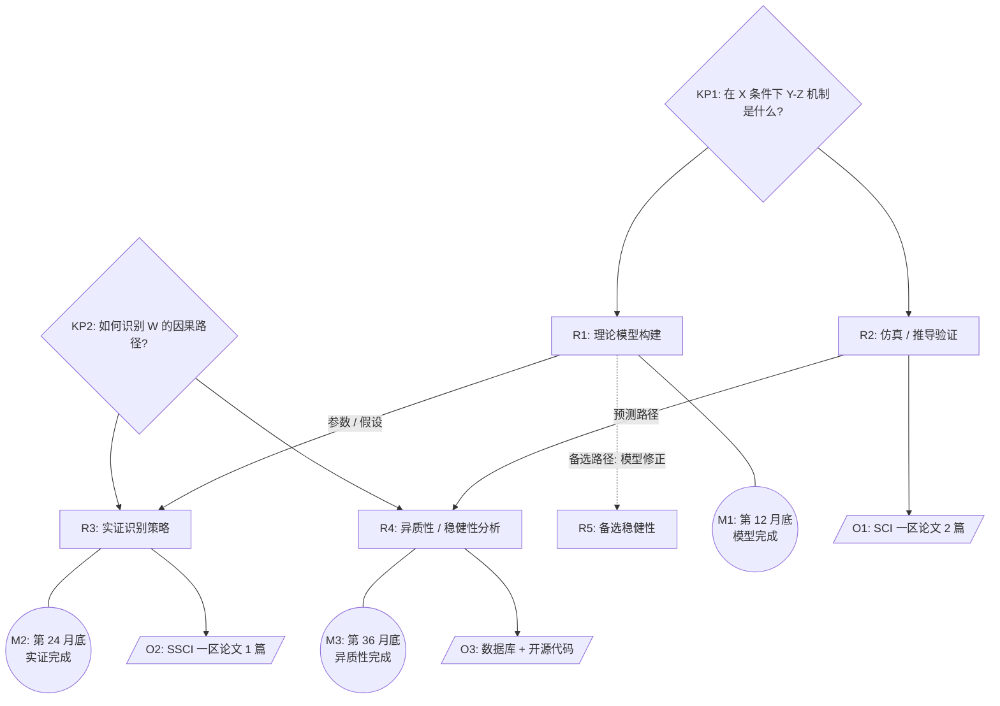

# 研究方案与技术路线撰写 Prompt（深度版）

> 用途：起草 / 重写 NSFC 申请书"拟采取的研究方案及可行性分析"模块（约 3000-5000 字 + 1 张技术路线图）。

研究方案是函评打分中"研究方案的可行性与合理性"维度的核心。**评审专家的眼睛会本能扫向技术路线图——一张无信息量的路线图反而扣分**。本文件给出技术路线图的"6 要素文字描述模板"和可行性论证的"3 段式（人/物/法）"。

---

## 一、技术路线图的 6 要素与文字描述模板

### 1.1 为什么必须放图？

NSFC 申请书要求"技术路线图"的本质，是让函评专家在 60-180 秒内完成以下 3 件事：

1. **看清"做什么"**——研究内容 R1-R5 之间的依赖关系
2. **看清"怎么做"**——数据流、方法、判据
3. **看清"产出什么"**——论文、模型、数据库等具体可交付成果

**反面例子**：5 个矩形横向排列、用箭头串起来——评审会扣分。

### 1.2 6 要素清单（杰青范式）

一张合格的技术路线图必须包含以下 6 要素：

| # | 要素 | 形状建议 | 位置 | 信息量 |
| --- | --- | --- | --- | --- |
| **1** | 关键科学问题节点 (KP) | 菱形 / 椭圆 | 顶部 | 与正文 KP 一致编号 |
| **2** | 研究内容节点 (R) | 矩形 | 中部 | 与正文 R 一致编号 |
| **3** | 数据 / 方法流（连线 + 标签） | 带标签箭头 | 节点之间 | 写"数据 X / 模型 Y" |
| **4** | 依赖关系（实线 vs 虚线） | 实线 = 主路径；虚线 = 备选 | 连线样式 | 风险路径明示 |
| **5** | 里程碑节点 (M) | 六边形 / 带星矩形 | 右侧 | M1: 完成 …… M2: 完成 …… |
| **6** | 输出节点 (O) | 平行四边形 | 底部 | O1: 论文 N 篇、O2: 数据库等 |

### 1.3 Mermaid 文字模板（含 6 要素）



### 1.4 ASCII 替代方案（用于 .md 直接渲染）

```
            ┌──────────────────────┐  ┌──────────────────────┐
            │ KP1: X-Y 机制        │  │ KP2: W 因果识别      │
            └──────────┬───────────┘  └──────────┬───────────┘
                       │                          │
        ┌──────────────┴────┐         ┌──────────┴───────────┐
        ▼                   ▼         ▼                       ▼
   ┌─────────┐       ┌─────────┐  ┌─────────┐         ┌─────────┐
   │ R1 理论 │──────►│ R2 仿真 │  │ R3 实证 │────────►│ R4 异质 │
   └─────────┘ 假设  └─────────┘  └─────────┘ 稳健性   └─────────┘
        │                   │                                 │
        ▼ 备选              ▼                                 ▼
   ┌─────────┐       ┌────────────┐                    ┌─────────────┐
   │ R5 备选 │       │ M1: 12 月  │                    │ M3: 36 月   │
   └─────────┘       └────────────┘                    └─────────────┘
                                ▼
                  ┌─────────────────────────────┐
                  │ O1: 论文 / O2: 数据库 / O3: 开源代码 │
                  └─────────────────────────────┘
```

### 1.5 路线图文字描述模板（必备 — 用于正文紧跟图后）

技术路线图除了有图，**正文紧跟必须有 200-400 字的"文字描述"**——评审有时只读文字（特别是打印稿模式）：

```
【技术路线图文字描述模板】

本项目的总体研究路径如图 X 所示，由 KP1 和 KP2 两个关键科学问题驱动，
对应 R1-R{n} 共 {n} 个研究内容，最终形成 O1-O{m} 共 {m} 项成果产出。

研究路径分为 3 条主线：
- 主线 1（理论 → 仿真）：R1 → R2，对应 KP1，预期 12 个月内完成（M1）；
- 主线 2（实证识别 → 稳健性）：R3 → R4，对应 KP2，预期 24-36 个月完成（M2-M3）；
- 主线之间的耦合点：R1 输出的"参数 / 假设"作为 R3 的识别先验，R2 的预测路径
  作为 R4 异质性分析的验证基准。

风险与备选路径（虚线）：若 R1 在前 6 个月发现主模型推导存在 X 类困难，将
触发备选路径 R5（采用 Y 方法对模型做局部修正），保证 R3 实证识别不受影响。

最终成果：O1（SCI 一区论文 2 篇）来自 R2 的方法学贡献；O2（SSCI 一区论文 1 篇）
来自 R3 的实证发现；O3（开源数据库 + 代码）作为方法学产出，与 R4 异质性
分析共同公开。
```

---

## 二、各研究内容（R）的具体方案 — 5 段式

对每个 R{i}（建议每个 R 占 600-1200 字），按以下 5 段结构展开：

### 段 1 — 研究问题与目标（1 段，约 100-150 字）

呼应"研究内容"章节中 R{i} 的标题与目标，**不要重复抄写**。

> **句式**："R{i} 聚焦 …… 问题，目标是 …… 。本部分将围绕 KP{j} 展开。"

### 段 2 — 数据 / 实验对象 / 仿真设定（1 段，约 150-300 字）

含规模、获取方式、伦理审批（如适用）。

- **实验类**：实验对象、样本量计算、对照组设计、伦理批件
- **实证类**：数据来源、时间跨度、变量定义、缺失值处理
- **仿真类**：仿真平台、参数空间、随机种子、收敛判据
- **理论类**：数学环境、关键假设、推导路径

### 段 3 — 方法与模型（2-3 段，约 300-600 字）

**这一段是评审"看不看得懂"的核心**。

- **实证类**：必须给出 **识别策略**（IV / DiD / RD / SCM / 事件研究 / 双重差分等），并写明"识别假设是什么、如何检验"
- **实验类**：必须给出 **对照与控制**，如剂量-反应曲线、单变量控制、对照组规模
- **理论类**：必须给出 **关键定理 / 命题**，至少给出主定理的"陈述 + 证明思路"
- **算法类**：必须给出 **关键算法的伪代码 / 流程**，并和 SOTA baseline 对比

### 段 4 — 输出指标与判据（1 段，约 100-200 字）

**明确"成功 / 失败"的判据**。这一段是函评专家最容易找碴的——很多本子写"我们将开展 ……"，但说不清"什么算成功"。

- **句式**："R{i} 的成功判据为：
  - （1）方法层面：{{显著性 p<0.05、效应量 > 0.3 / Top-1 提升 ≥ 2% / 拟合优度 R²>0.7}}
  - （2）应用层面：{{在 N 个 benchmark 上达到 SOTA / 在 X 政策情境下产生可解释结论}}
  - （3）产出层面：{{至少 1 篇 SCI 一区论文作为方法学产出}}"

### 段 5 — 风险与备选方案（1 段，约 100-200 字）

写 1-2 个 **Plan B**——不是"我们不会失败"。

- **句式**："R{i} 的主要风险在于 …… 。若出现 …… 情况，将采用 …… 备选方案：（1）{{方法学备选}}；（2）{{数据 / 样本备选}}。备选方案已在前期工作 …… 中初步验证可行。"

---

## 三、可行性分析"3 段式（人 / 物 / 法）" + 理论可行 = 4 角度

可行性分析是函评打分中"可行性与合理性"的核心。本节给出 NSFC 公开范式整理的"3 段式（人 / 物 / 法）+ 理论可行"。

### 3.1 法（方法可行）— 最重要、必须放预实验

**目标**：让评审看到"申请人已经做出了核心方法的早期版本"。

- **句式**："申请人已在 [前期工作 a, b] 中验证了 …… 方法的可行性。如图 Y 所示（**附预实验图**），在 N=20 的预实验中，X 现象在 p<0.01 显著性水平下被观察到。这表明本项目主方法在 …… 条件下已具备落地基础。"
- **必备**：
  - 1 张预实验图（**注明"申请人课题组前期数据"**）
  - 1 段实验数据描述
  - 1 处对应"已发表论文 / 已申请专利 / 已开源代码仓库"的引用

### 3.2 物（条件可行）

**目标**：让评审看到"实验室、仪器、平台都已就位"。

- **句式**："本项目依托 [国家 / 教育部 …… 重点实验室]（评估等级：优秀）开展。本项目主要使用 …… 仪器（型号 ……，主要性能 ……，已有可使用机时 N 小时 / 月）。计算资源方面，依托 …… 高性能计算集群（NN 个节点，NN 块 GPU）。协作单位 …… 提供 …… 样本 / 数据 / 平台支撑。"
- **必备**：
  - 实验室全名 + 评估等级
  - 仪器型号 + 关键性能指标 + 可用机时
  - 协作单位的合作内容（**已有合作论文 / 共建项目**）

### 3.3 人（团队可行）

**目标**：让评审看到"团队结构合理、分工清晰、有合作历史"。

- **句式**："本项目研究团队由申请人 + N 名共同申请人 + N 名学生组成。
  - **申请人 X**（教授，研究方向：……）：负责总体设计、KP1 的理论建模、R1 R3 的实验设计与论文撰写
  - **共同申请人 Y**（副教授，研究方向：……）：负责 R2 的算法开发与代码实现、KP2 的方法论支撑
  - **共同申请人 Z**（讲师，研究方向：……）：负责 R4 的数据采集、数据库建设、与协作单位 …… 的对接
  - 博士研究生 N 人 + 硕士研究生 N 人：参与 R2 R3 R4 的具体实施
  申请人与共同申请人 Y 已合作发表 SCI 论文 N 篇（[文献 a, b, c]），合作完成 NSFC 项目 1 项（[项目编号]）。"
- **必备**：
  - 每位成员的"分工"（不写"协助申请人完成所有内容"）
  - **历史合作产出**（合著 SCI 数 / 已结题项目）

### 3.4 理论可行（基础可行）

**目标**：让评审看到"方法论本身在已有文献中已被验证"。

- **句式**："本项目的方法论已在 [文献 d, e, f] 中得到验证。其中 [文献 d] 在 …… 场景下证明了 …… 的有效性；[文献 e] 进一步将 …… 扩展到 ……；本项目在此基础上 ……。"
- **必备**：3 篇 SCI / SSCI 高水平文献

---

## 四、写作 Prompt 模板（用于 Claude / 其他 LLM）

```
你是 NSFC 申请书写作助手，且具备绘制技术路线图的能力。请帮我起草「拟采取的研究方案及可行性分析」章节。

【已有信息】
- 研究内容编号 R1-R{{n}} 与各自标题：{{R1: …; R2: …; R3: …}}
- 关键科学问题 KP1-KP{{m}}：{{KP1: …; KP2: …}}
- 已有的预实验 / 前期数据：{{……}}
- 团队可用平台 / 仪器：{{……}}
- 已有协作单位：{{……}}
- 团队成员（含分工）：{{……}}

【写作要求 — 章节结构】

## 第 1 部分：总体研究方案与技术路线图（约 600-800 字）

A. 用 1 段说明 R1-Rn 之间的逻辑关系（递进 / 并联 / 嵌套）

B. 给出 1 张「技术路线图」 — 用 Mermaid 描述，必须包含 6 要素：
   - 要素 1：关键科学问题节点 (KP)
   - 要素 2：研究内容节点 (R)
   - 要素 3：数据 / 方法流（连线 + 标签）
   - 要素 4：依赖关系（实线 = 主路径，虚线 = 备选）
   - 要素 5：里程碑节点 (M)
   - 要素 6：输出节点 (O)

C. 在图后给出 200-400 字的"文字描述模板"——包括 N 条主线、风险与备选路径、最终成果

## 第 2 部分：各研究内容的具体方案（每个 R 600-1200 字）

对每个 R{{i}}，按以下 5 段结构展开：
1. 研究问题与目标（1 段）
2. 数据 / 实验对象 / 仿真设定（1 段）
3. 方法与模型（2-3 段，写出关键方程 / 算法 / 实验方案；实证类必须给出识别策略；实验类必须给出对照与控制；理论类必须给出关键定理）
4. 输出指标与判据（1 段，明确"成功 / 失败"的判据）
5. 风险与备选方案（1 段，写出 1-2 个 Plan B）

## 第 3 部分：可行性分析（约 800-1200 字，按"3 段式 + 理论可行" 4 角度）

1. **法（方法可行）**：申请人 / 团队已掌握核心技术；**必须附 1 张预实验图 + 数据描述**
2. **物（条件可行）**：实验室、平台、仪器、合作单位已就位
3. **人（团队可行）**：成员分工 + 历史合作产出
4. **理论可行**：本项目方法论已有学术基础（≥ 3 篇支撑文献）

【自检清单】
- [ ] 是否给出技术路线图（Mermaid）？
- [ ] 路线图是否含 6 要素？
- [ ] 路线图后是否有 200-400 字文字描述？
- [ ] 节点是否与 R1-Rn 一一对应？
- [ ] 每个 R 是否包含"识别策略 / 实验设计 / 关键定理"中至少一项细节？
- [ ] 每个 R 是否给出"成功判据"？
- [ ] 每个 R 是否给出 1-2 个 Plan B？
- [ ] 可行性"3 段式 + 理论"是否齐全？
- [ ] 是否包含至少 1 处预实验数据 / 图？

请先输出技术路线图（Mermaid）+ 各 R 的 1 句话方案概述，等我确认后展开全文。
```

---

## 五、可行性 4 角度速查表

| 角度 | 核心句式 | 证据类型 | 易扣分项 |
| --- | --- | --- | --- |
| **法**（方法可行） | "申请人已在 …… 中验证 …… **（附预实验图）**" | 预实验图 + 数据表 + 已发表论文 | 缺预实验图 |
| **物**（条件可行） | "依托 …… 国家 / 教育部 …… 实验室（评估等级 ……）；主要使用 …… 仪器（型号、机时）" | 平台名 + 仪器型号 + 协作单位 | 平台未列等级 |
| **人**（团队可行） | "团队成员 X 负责 …，Y 负责 …，已合作产出 …" | 历史合著 SCI 数 / 已结题项目 | 写"协助申请人" |
| **理论可行** | "本项目方法论已在 …… 文献中得到验证" | 3 篇高水平文献 | 仅引申请人自己的论文 |

---

## 六、注意事项

- **技术路线图严禁简单"流程框"** —— 评审看到无信息量的图反而扣分
- 风险与备选方案要写"如果 X 方法行不通 → 改用 Y"，**而非"我们不会失败"**
- 预实验数据若用图，**图注必须注明"申请人课题组前期数据"**
- 路线图与文字描述要互相印证——评审有时只读文字（打印稿模式）
- 团队成员分工不要写"协助申请人完成所有研究内容"——这种表述等于"挂名"
