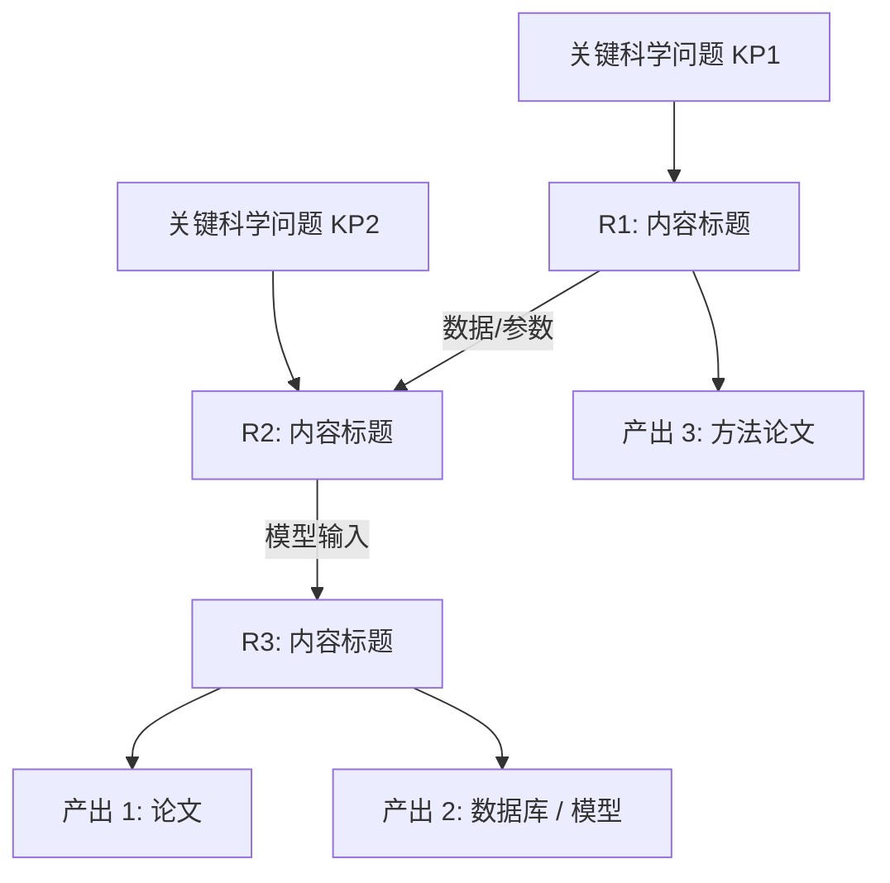

# 研究方案与技术路线撰写 Prompt

> 用途：起草 / 重写 NSFC 申请书"拟采取的研究方案及可行性分析"模块（约 3000-5000 字 + 1 张技术路线图）。

## 模板

```
你是 NSFC 申请书写作助手，且具备绘制技术路线图的能力。请帮我起草「拟采取的研究方案及可行性分析」章节。

【已有信息】
- 研究内容编号 R1-R{{n}} 与各自标题：{{R1: …; R2: …; R3: …}}
- 关键科学问题 KP1-KP{{m}}：{{KP1: …; KP2: …}}
- 已有的预实验 / 前期数据：{{……}}
- 团队可用平台 / 仪器：{{……}}
- 已有协作单位：{{……}}

【写作要求 — 章节结构】

## 第 1 部分：总体研究方案与技术路线图（约 600-800 字）
- 用 1 段说明 R1-Rn 之间的逻辑关系（递进 / 并联 / 嵌套）
- 必须给出 1 张「技术路线图」 — 用 Mermaid 或 ASCII 描述：
  - 节点 = 研究内容 R1, R2, …
  - 连线 = 数据流 / 方法依赖
  - 输出节点 = 预期成果（论文 / 模型 / 数据库 / 装置）
  - 在图侧标出对应的关键科学问题

## 第 2 部分：各研究内容的具体方案（每个 R 600-1200 字）
对每个 R{{i}}，按以下 5 段结构展开：
1. 研究问题与目标（与研究内容章节呼应，1 段）
2. 数据来源 / 实验对象 / 仿真设定（1 段，含规模、获取方式）
3. 方法与模型（2-3 段，写出关键方程 / 算法 / 实验方案；若为实证类需给出识别策略；若为实验类需给出对照与控制）
4. 输出指标与判据（1 段，明确"成功 / 失败"的判据）
5. 风险与备选方案（1 段，写出 1-2 个 Plan B）

## 第 3 部分：可行性分析（约 800-1200 字，分 4 个角度）
1. **理论可行**：本项目方法论已有学术基础（≥ 3 篇支撑文献）
2. **方法可行**：申请人 / 团队已掌握核心技术；**附 1 张预实验图 + 数据**
3. **条件可行**：实验室、平台、仪器、合作单位已就位
4. **团队可行**：成员分工 + 历史合作产出

【自检清单】
- [ ] 是否给出技术路线图（Mermaid / ASCII）？
- [ ] 节点是否与 R1-Rn 一一对应？
- [ ] 每个 R 是否包含"识别策略 / 实验设计"细节？
- [ ] 每个 R 是否给出"成功判据"？
- [ ] 可行性 4 角度是否齐全？
- [ ] 是否包含至少 1 处预实验数据？

请先输出技术路线图（Mermaid）+ 各 R 的 1 句话方案概述，等我确认后展开全文。
```

## 技术路线图 Mermaid 模板



## 可行性分析 4 角度模板

| 角度 | 核心句式 | 证据类型 |
| --- | --- | --- |
| 理论 | "本项目方法论已在 …… 文献中得到验证" | 3 篇 SCI / SSCI 高水平文献 |
| 方法 | "申请人已在 …… 中验证 ……（附预实验图）" | 预实验图 + 数据表 + 已发表论文 |
| 条件 | "依托 …… 国家 / 教育部 …… 实验室" | 平台名 + 仪器型号 + 协作单位 |
| 团队 | "团队成员 X 负责 …，Y 负责 …，已合作产出 …" | 历史合著 SCI 数 / 已结题项目 |

## 注意事项

- 技术路线图严禁简单"流程框" — 评审看到无信息量的图反而扣分
- 风险与备选方案要写"如果 X 方法行不通 → 改用 Y"，而非"我们不会失败"
- 预实验数据若用图，图注必须注明"申请人课题组前期数据"
